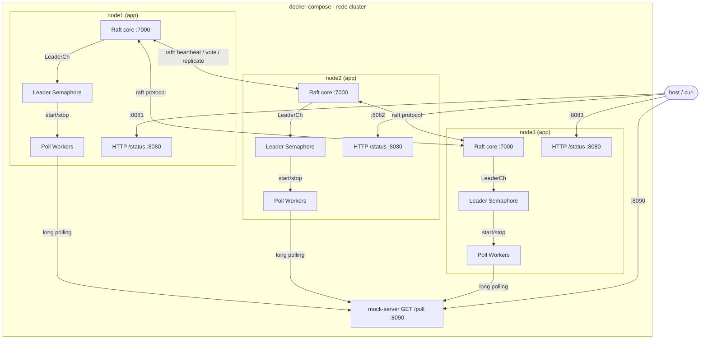
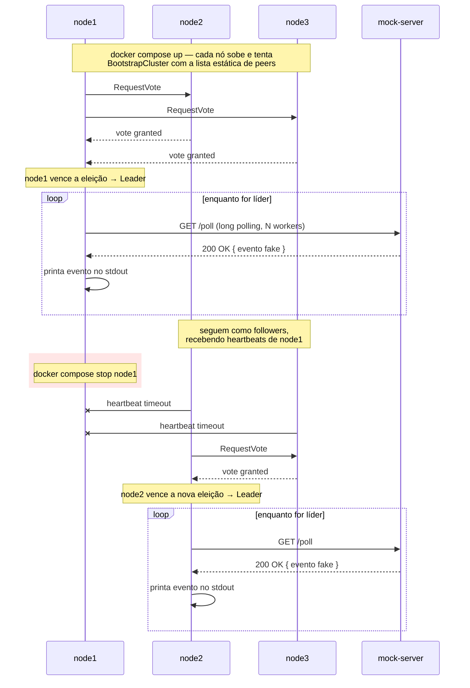

# Leader Election & Long Polling com Raft

POC de eleição de líder distribuída usando [hashicorp/raft](https://github.com/hashicorp/raft).
3 réplicas do mesmo binário formam um cluster; **apenas o líder** faz long polling
numa API mockada e imprime os eventos recebidos. Se o líder cai, o cluster reelege
outro em segundos, sem intervenção manual.

## Estrutura

```
app/            # binário que participa do cluster Raft (eleição + polling + /status)
mock-server/    # API mockada com long polling real (eventos gerados com faker)
docker-compose.yml
```

As 3 réplicas (`node1`, `node2`, `node3`) se conhecem por uma lista estática de
peers — como um `StatefulSet` do Kubernetes, mas rodando localmente via
docker-compose.

## Arquitetura



Cada nó `app` roda o mesmo binário: núcleo Raft (eleição/replicação via TCP na
porta `7000`, só na rede interna), um "leader semaphore" que ouve `LeaderCh()`
e liga/desliga os workers de polling, e uma API `/status` exposta ao host.
Apenas o `mock-server` e os endpoints `/status` são acessíveis de fora do
docker-compose.

## Fluxo



## Como rodar

```bash
docker compose up -d --build
```

Depois de alguns segundos, um dos nós vira líder e passa a imprimir eventos:

```bash
docker compose logs -f node1 node2 node3
```

Consultar o estado de qualquer nó:

```bash
curl localhost:8081/status   # node1
curl localhost:8082/status   # node2
curl localhost:8083/status   # node3
```

## Testando o failover

```bash
docker compose stop node2     # supondo que node2 seja o líder atual
docker compose logs -f node1 node3   # um deles assume e retoma o polling em segundos
docker compose start node2    # volta ao cluster como follower
```

## Configuração

| Variável (env) | Onde | Efeito |
|---|---|---|
| `POLL_WORKERS` | `app` | Nº de goroutines de long polling concorrentes quando o nó é líder (vazão de eventos) |
| `POLL_MIN_DELAY` / `POLL_MAX_DELAY` | `mock-server` | Intervalo aleatório até um novo evento "aparecer" |
| `POLL_MAX_WAIT` | `mock-server` | Timeout do long polling (retorna `204` se não houver evento) |

## Encerrar

```bash
docker compose down
```

Detalhes de requisitos, arquitetura e decisões técnicas: veja [SPEC.md](SPEC.md).
